## Heap

- __완전 이진트리__ 형태의 자료구조. _priority queue_ 구현을 위해 사용한다. 

- 모든 노드에 저장된 값은 자식 노드에 저장된 _값_ 보다 크거나 같아야한다

  > 여기서의 값은 우선순위를 가정한다. value 가 큰 값은 max heap, 적은 값은 min heap 이라고 한다. 

- 최솟값, 최댓값을 쉽게 추출할 수 있다. 


### priority queue

> 우선순위가 높은 데이터가 나온다.

우선순위 큐는 일반 큐와 같은 `enqueue`, `dequeue`  의 기능을 가지지만, __연산의결과__가 다르다. _queue_ 의 경우에는 FIFO 구조로 먼저 들어간 데이터가 먼저 반환되는 연산을 가지지만, _priority queue_ 의 경우에는 __우선순위가 높은 데이터가 나온다는__ 특징을 가진다. 

- enqueue
- dequeue 

의 대표적인 기능또한존재하는데, 일반 큐와 __. 큐의 경우, 먼저 들어간 데이터가 나오는 __FIFO__ 의 연산을 가지지만, __우선순위 큐__의 경우에는


### priority queue 구현방법

대표적으로 __힙__ 을 이용한다. _배열_, _연결리스트_ 를 사용하는 방법도 있지만 아래와 같은 이유로 추천되지 않는다. 

1. array

   우선순위가 높을수록 배열의 앞쪽에 데이터를 위치시킨다. 

   - __장점__ 

     우선순위 삽입 / 반환 연산이 쉽지만,

   - __단점__ 

     데이터를 삽입 / 삭제하는 과정에서 데이터를 한칸씩 밀거나 당겨야한다. 

     삽입의 위치를 찾기 위해서 모든 데이터와 연산을 비교해야 할 수 있다. 


2. linked_list

- __장점__

  데이터를 삽입 / 삭제하는 과정에서 밀거나 당길 필요가 없다. 

- __단점__

  삽입의 위치를 찾기 위해서 모든 데이터와 연산을 비교해야 할 수 있다. 


   ### heap을 이용한 priority 만들기

   ##### 데이터 삽입 과정 (min heap의 경우로 생각)

   마지막 데이터가 '우선순위가' 낮다는 가정하에, 마지막 노드에 저장한다. 

   여기에서 __마지막노드__ 란 최하위 레벨의 가장 오른쪽 노드를 말한다. 삽입 후, 부모 노드와 값을 비교한다.


   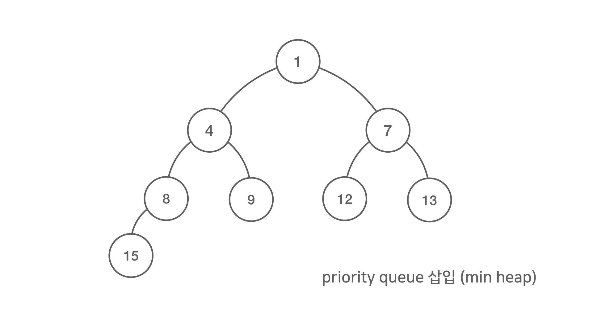

   

   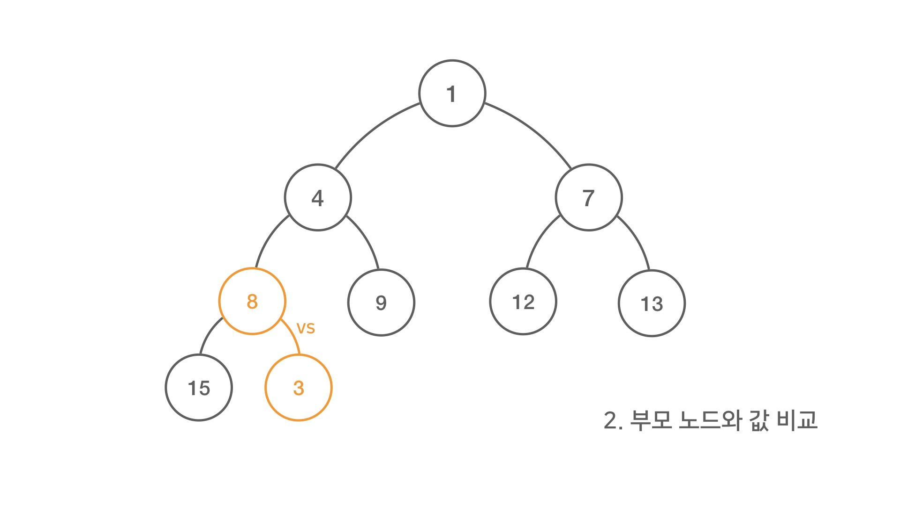

   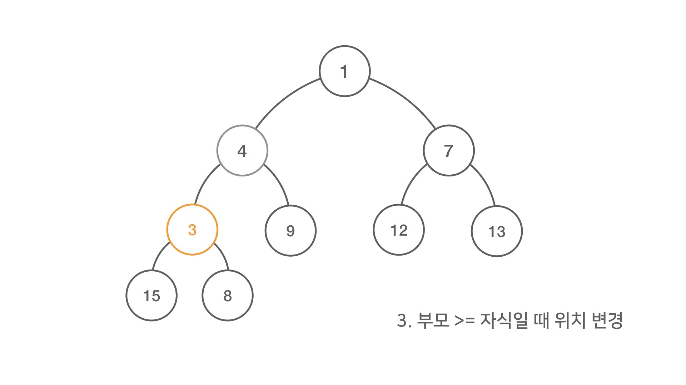

   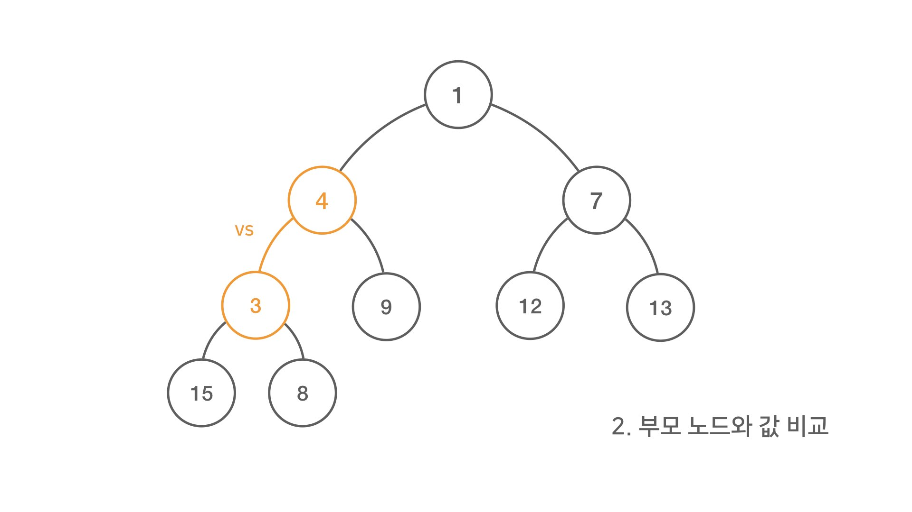

   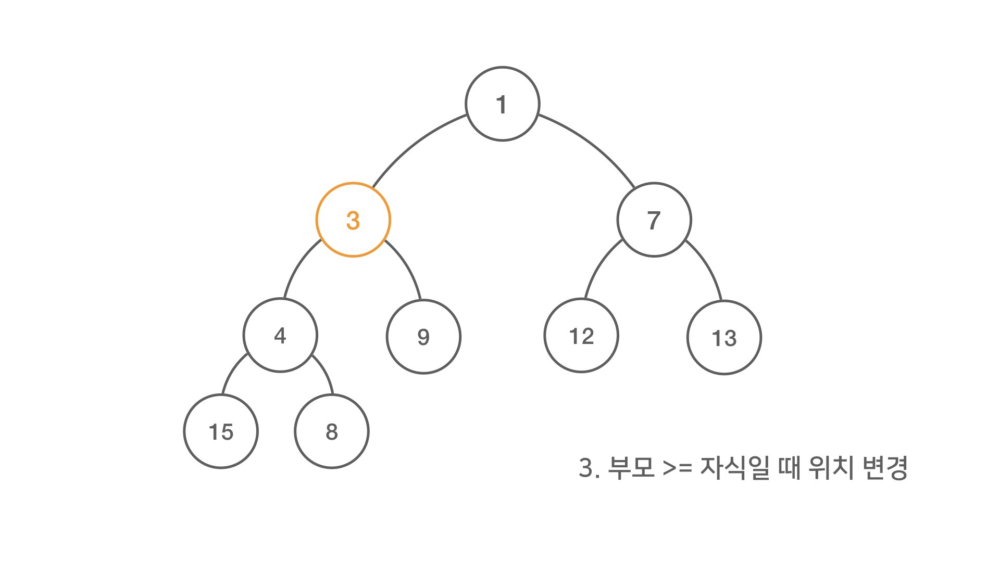

   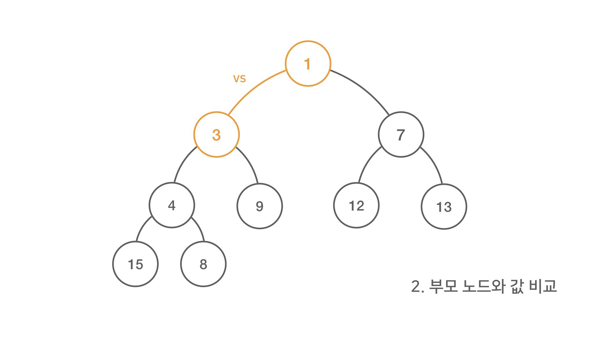

   


##### 데이터 삭제 과정 (min heap)

데이터 삭제는 루트에서만 이루어진다. 이후 루트는 마지막 노드에 있는 데이터를 루트로 옮긴 후 정렬을 진행한다. 


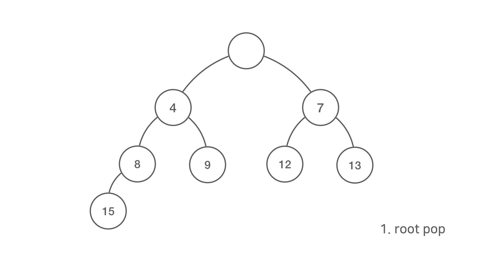

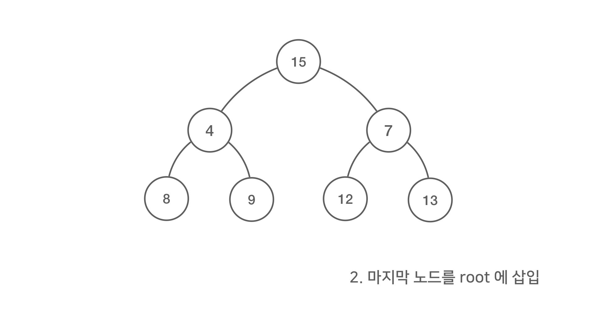

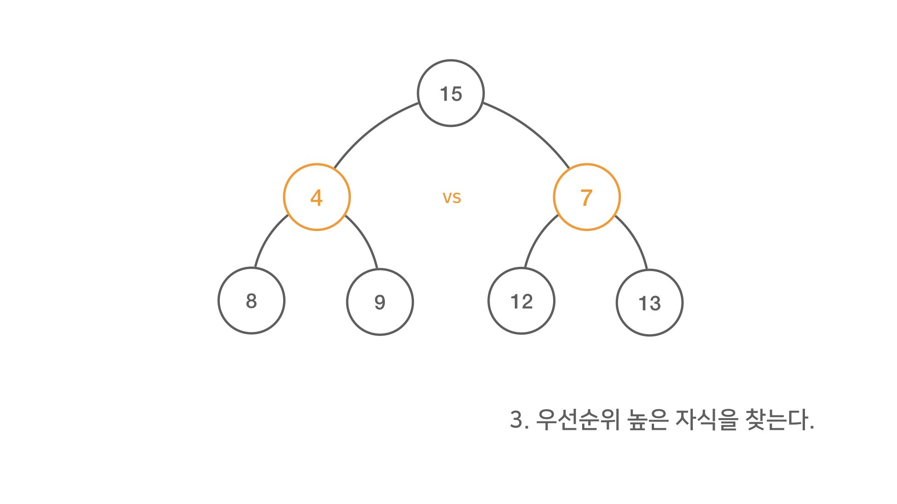

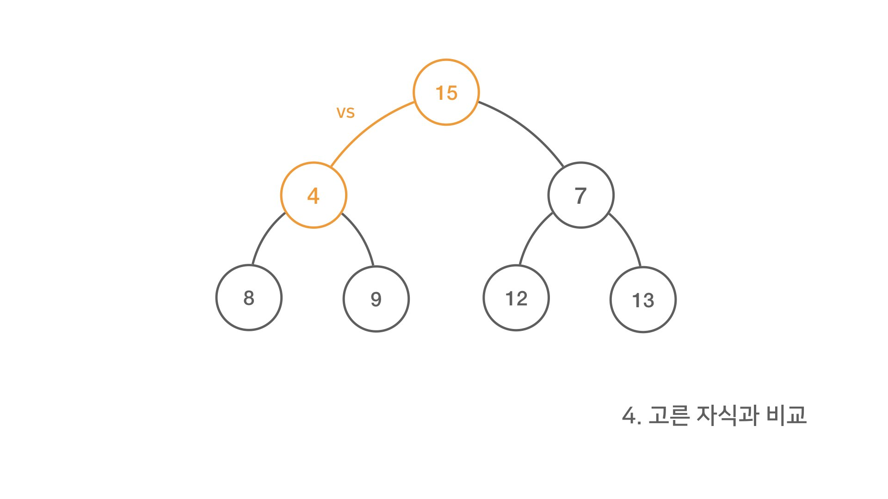

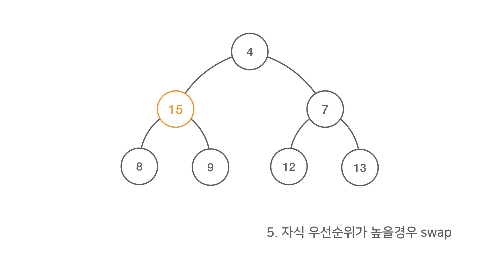

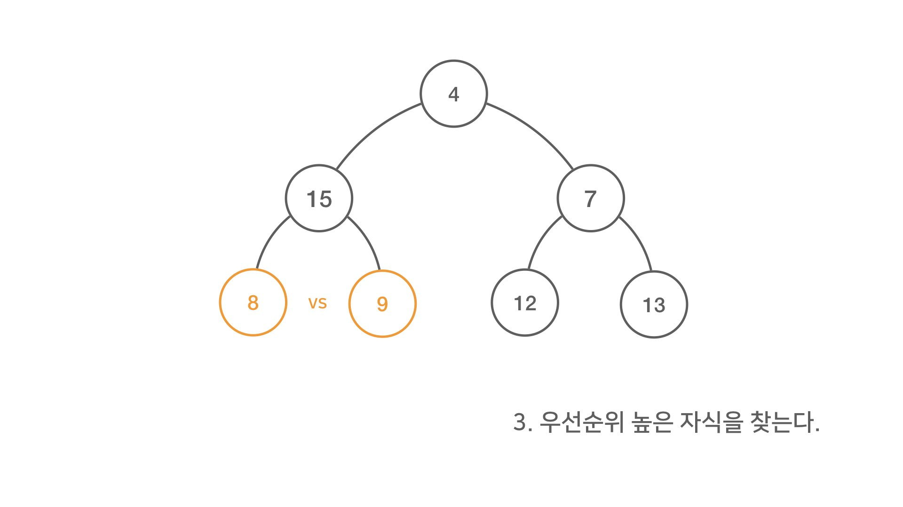


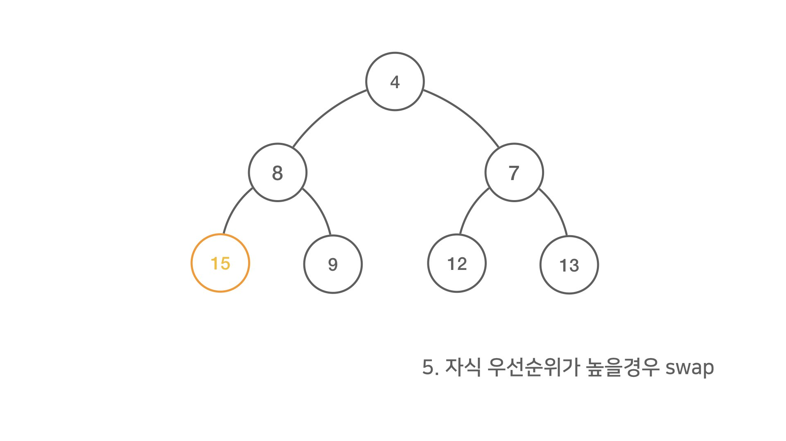

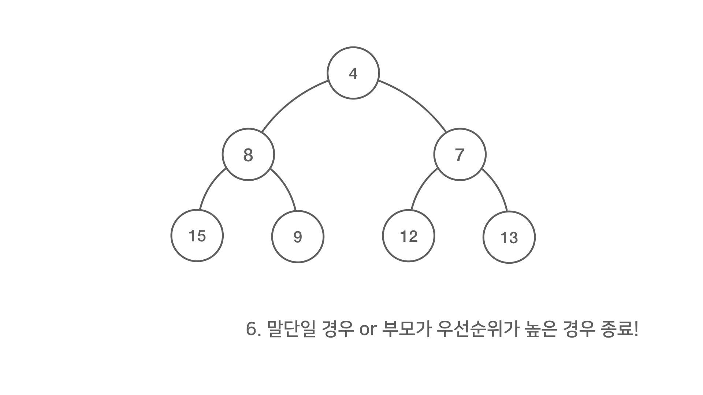

### python 에서의 heap 구현

 _java_ 에서는 PriorityQueue 클래스를 제공해주지만, python 에서는 `heapq` 의 모듈을 제공한다.

```python
import heapq
```

 자료구조가 아닌 모듈을 제공해줌으로, 빈 리스트를 생성후 삽입 / 삭제를 `heapq` 모듈을 통해 데이터를 추가 / 삭제한다. 

```python
# 빈 리스트 생성 (min heap 기준)
heap = []
# 원소 추가

heapq.heappush(heap, 4)
heapq.heappush(heap, 1)
heapq.heappush(heap, 7)
heapq.heappush(heap, 3)
print(heap)

# 원소 삭제
# heappop() 함수는  원소를 삭제할 때마다 이진 트리를 재배치한다. 따라서 루트 노드는 최소 값이 맞지만, 다음 값이 최소값은 아니다. 
print(heapq.heappop(heap))
print(heap)

# 최소 값 얻기 
print(heap[0])
```

##### 기존 리스트 heap 으로 변환하기

이미 원소가 들어있는 리스트 힙으로 만들려면 `heapq` 모듈의 `heapify()`라는 함수에 사용하면 됩니다.

```python
heap = [4, 1, 7, 3, 8, 5]
# 힙 구조로 재배치되어, 최소값이 0에 위치. 시간복잡도 : O(N)
heapq.heapify(heap)
print(heap)
[1, 3, 5, 4, 8, 7]
```

##### heapq 는 최소 heap 기준이기 때문에, 최대 heap 의 경우 아래와 같이 사용해보자.

```python
import heapq

nums = [4, 1, 7, 3, 8, 5]
heap = []

for num in nums:
  heapq.heappush(heap, (-num, num))  # (우선 순위, 값)

while heap:
  print(heapq.heappop(heap)[1])  # index 1
```

##### 최소값 / 최대값 찾기 

```python
import heapq

def minheap(nums, k):
  heap = []
  for num in nums:
    heapq.heappush(heap, num)

  kth_min = None
  for _ in range(k):
    kth_min = heapq.heappop(heap)
  return kth_min

print(minheap([4, 1, 7, 3, 8, 5], 3))
```


### 성능 평가

1. _array_ 기반 시간 복잡도
   - 데이터 삽입: **O(n)**
   - 데이터 삭제: **O(1)**
2. _linked list_ 기반 시간 복잡도
   - 데이터 삽입: **O(n)**
   - 데이터 삭제: **O(1)**

3. _**heap**_ 기반 시간 복잡도 
   - 데이터 저장: **O(log^2n)**
   - 데이터 삭제: **O(log^2n)**


